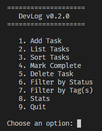

# DevLog

> I'm transitioning into software engineering, and I wanted to learn Python
> properly — deeply, not just enough to pass. So I'm building this CLI tool
> one feature at a time, in public, documenting every step in the commit
> history. From a bare script to an installable, tested, async-capable package.

A personal developer productivity CLI tool built in Python. Track tasks, log
learning notes, monitor job applications, and generate progress reports — all
from the terminal.

---

## DevLog in action



<!--
  Screenshot placeholder. To add:
  1. Run DevLog with a few sample tasks loaded so it looks alive
  2. Capture the terminal window (macOS: Cmd+Shift+4 then spacebar)
  3. Save as docs/images/demo.png and commit it
  Upgrade to a terminal GIF (asciinema / vhs) around Phase 5-6.
-->

---

## Why this project exists

DevLog is a learning vehicle with a real destination. Rather than working
through disconnected tutorials, I'm building one cohesive application across
10 phases — each phase introducing a layer of Python, from fundamentals to
expert-level internals.

The goal is depth: understanding not just *how* Python works, but *why* it
was designed that way. The commit history is the record of that journey —
one consistent, documented step at a time.

---

## Status

Under active development — building in public across 10 phases.

| Phase | Focus | Status |
|-------|-------|--------|
| 1 | Foundations | ✅ Complete |
| 2 | Data Structures | ✅ Complete |
| 3 | Functions & Modules | 🔨 In progress |
| 4 | Object-Oriented Python | ⬜ Planned |
| 5 | File I/O & Error Handling | ⬜ Planned |
| 6 | Standard Library | ⬜ Planned |
| 7 | Advanced Python | ⬜ Planned |
| 8 | The Outside World (APIs, DB) | ⬜ Planned |
| 9 | Concurrency & Async | ⬜ Planned |
| 10 | Expert Level & Packaging | ⬜ Planned |

---

## Features

Current:
- Interactive terminal menu with input validation
- Add, list, and filter tasks held in memory
- Tasks carry id, title, status, priority, and tags

Planned (by v1.0.0):
- Persistent storage (JSON, then SQLite)
- Live job-listing search via public APIs
- Productivity stats and CSV report export
- Full pytest test suite and type hints
- Installable via `pip install devlog`

---

## Getting started

Requires Python 3.11+

```bash
# Clone the repo
git clone https://github.com/muhib/devlog.git
cd devlog

# (Recommended) create and activate a virtual environment
python -m venv .venv
source .venv/bin/activate        # Windows: .venv\Scripts\activate

# Run DevLog
python main.py
```

Once packaging lands in Phase 10, this becomes:

```bash
pip install devlog
devlog --help
```

---

## Usage

```bash
python main.py
```

Then follow the on-screen menu to add, list, and filter tasks.
A full command reference will be added as the CLI matures.

---

## Project structure

```
devlog/
├── main.py            # entry point and menu loop
├── docs/              # learning notes and images
│   └── images/
├── README.md
└── CHANGELOG.md
```

This structure evolves across phases — splitting into a proper package
in Phase 3, gaining a test suite in Phase 7, and a `pyproject.toml`
in Phase 10.

---

## The build journey

This project is built one phase at a time, with every day's work captured
in the commit history using conventional commits (`feat:`, `fix:`, `refactor:`,
etc.). Browsing the commits shows the project growing from first principles —
the learning made visible.

- **Granular record:** the Git commit history (every day)
- **Milestones:** tagged releases `v0.1.0` through `v1.0.0` (every phase)

---

## Tech & concepts covered

By completion, this project will have hands-on coverage of:
Python core and the object model, OOP, the standard library, decorators,
generators, context managers, type hints, testing with pytest, HTTP and REST
APIs, SQLite, concurrency with asyncio, and packaging for distribution.

---

## License

MIT